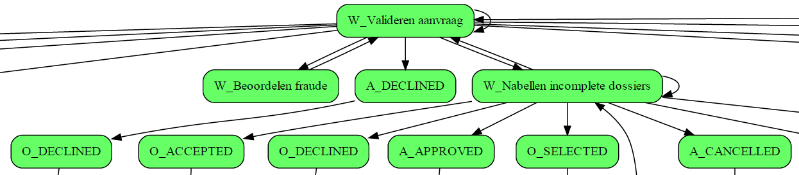
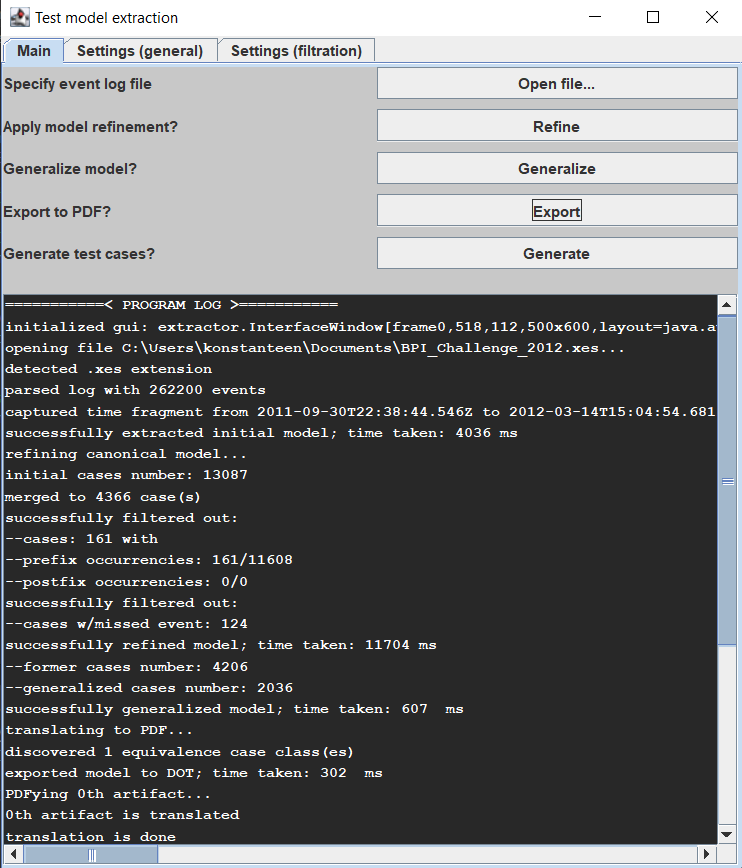

# Model extractor

<p align="center">
  " width="600"/>
</p>

Graduation CMC MSU MMXIX project. Process mining algorithm implementation
for deriving process model from event log.

## Supported log formats

- MXML
- XES
- Log4j2

## How to run

Project is Eclipse-oriented, nevertheless you should be able to build and
run the application via `ant` scripts. `Run` target of `custom.xml` does
launch the program. Java version used for development: 10.0.1.

## Functionality

- GUI for specifying analysis parameters: filtration settings, file browser,
diversified run modes (include/omit certain processing stage):

<p align="center">
  " width="500"/>
</p>

- custom mining algorithm for activity-driven process analysis
- export to GraphViz DOT format:

```
strict digraph G {
  1 [ label=" A_SUBMITTED " fillcolor="#66ff66" shape="box" style="rounded, filled" ];
  2 [ label=" A_PARTLYSUBMITTED " fillcolor="#66ff66" shape="box" style="rounded, filled" ];
  3 [ label=" A_PREACCEPTED " fillcolor="#66ff66" shape="box" style="rounded, filled" ];
  4 [ label=" W_Completeren aanvraag " fillcolor="#66ff66" shape="box" style="rounded, filled" ];
  5 [ label=" A_ACCEPTED " fillcolor="#66ff66" shape="box" style="rounded, filled" ];
  6 [ label=" O_SELECTED " fillcolor="#66ff66" shape="box" style="rounded, filled" ];
  7 [ label=" A_FINALIZED " fillcolor="#66ff66" shape="box" style="rounded, filled" ];
  ...
```

- visualization export to PDF

## Troubleshooting

For any questions or issues please refer to [Issues](https://github.com/kostmetallist/model-extractor/issues) page.
